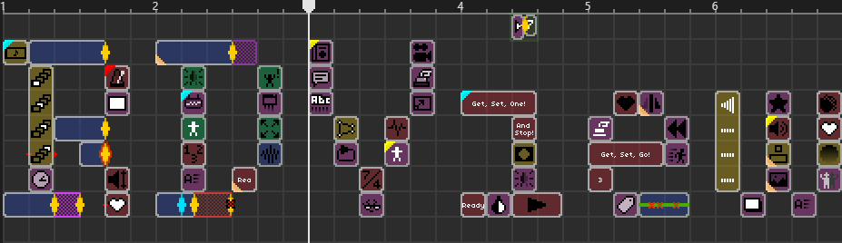
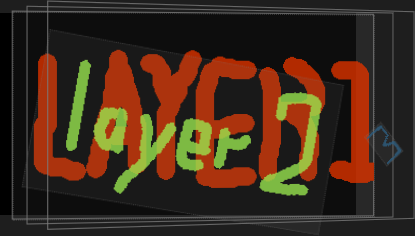
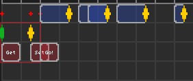
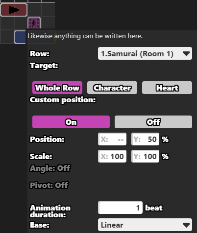

# RDView

这是一个简单的 CSS 样式表。
此项目以 CSS 样式表通过 HTML 展示节奏医生编辑器的静态界面，旨在更加可视化地编写节奏医生编辑器教程并展示在网页上或文档中。  
为了更广的兼容性，此项目不使用 Javascript 等代码动态修改界面，因此您甚至不需要任何额外的插件即可在 Visual Studio Code 里使用 Markdown 语言编写基于 RDView 的教程文档并实时预览其效果。

This is a simple CSS stylesheet.
This project presents the static interface of Rhythm Doctor Editor in HTML with CSS stylesheets, aiming at writing Rhythm Doctor Editor tutorials more visually and displaying them on web pages or in documents.  
For wider compatibility, this project doesn't use Javascript or other codes to modify the interface dynamically, so you don't even need any additional plugins to write RDView-based tutorials in Visual Studio Code using Markdown language and preview them in real time.

大部分事件的样式都已预定义完毕。  
您可以使用此项目来编写关于节奏医生编辑器的文档。  
阅读[此文档](tutorial_zh.md)中的教程与示例以开始。  

Most of the event styles have been predefined.  
You can use this project to write documentation about the Rhythm Doctor editor.  
Read the tutorial and examples in [this document](tutorial_en.md) to get started.

---